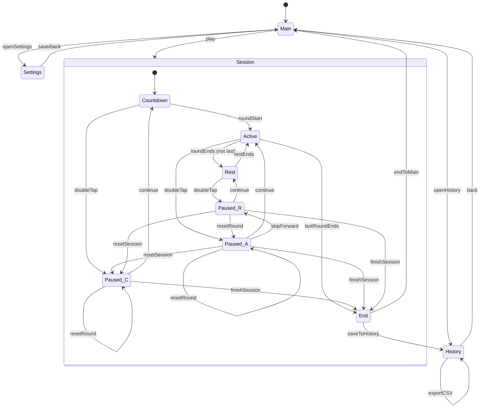

# Football Training App – Session Flow & Behavior Specification

Prepared: 2025-12-15 20:11:30
Owner: Ivica Rimac 

---

## 1) Mermaid State Machine

---

## 2) Behavior Specification

### 2.1 Pause, Resume & Timer Alignment
- **Double‑tap to pause** transitions to a paused node that reflects the origin state: `Paused_C` (Countdown), `Paused_A` (Active), `Paused_R` (Rest).
- **Continue/Resume** always returns to **the same state** that was paused.
- **When resuming**, align to the **next full second boundary** before restarting per‑second UI updates and stimulus changes, ensuring deterministic timing.

### 2.2 Reset (while paused)
- **Reset Session**: Reinitialize the entire session context (round index = 1, countdown = configured `countdownSec`, per‑round elapsed = 0, stimulus schedule at start). **Remain paused** (in `Paused_C`). Resume only when the user taps **Continue/Play**.
- **Reset Round**: Reinitialize the current round (round elapsed = 0, stimulus schedule at round start). From `Paused_A`/`Paused_R` move to `Paused_A`. From `Paused_C` it is a no‑op (already at session start). **Remain paused** until **Continue**.

### 2.3 Skip Forward (while paused)
- From `Paused_A`, **skipForward** prepares a jump to **Rest** for the current round. If the current round is the **last round**, the next progression after Rest will reach **End**. The session **remains paused** until **Continue** is chosen.

### 2.4 Finish Session
- **finishSession** from any paused node transitions **immediately** to **End**.

### 2.5 End Screen
- **Actions available**:
  - **Save to History**: persist the finished session and then navigate to **History**.
  - **End → Main**: return to **Main**.
- **Note**: **Export CSV** and **Compare** are **not** available from the End screen per updated requirements.

### 2.6 History Screen (source of export & comparison)
- **List of saved sessions**, ordered by date (newest first). Each shows summary (rounds, total time).
- **Selection via checkboxes**: single or multi‑select.
- **Actions**:
  - **Delete Selected** (confirm dialog).
  - **Export CSV** for selected sessions (or all, depending on selection).
  - **Back** → **Main**.
- **Comparison**: Accessed by **Main → History**. The History screen can compute and visualize deltas across **all saved sessions** or a selected subset.

---

## 3) Implementation Notes
- **Single scheduler** drives countdown, round ticks, and stimulus interval changes; use a **monotonic clock** and re-align after rotation or app resume.
- **No immediate repeats** of color/number during Active; optional RNG seed for reproducibility in QA.
- **Persistence**: `history.json` for saved sessions; CSV export constructed from the saved events and stats.
- **Accessibility**: large typography, color‑blind palettes, ≥ 44×44 px touch targets, screen reader labels.

---

## 4) Testing Checklist
- **Resume fidelity**: Pausing/resuming from each state returns to the correct origin state and maintains aligned timing.
- **Reset semantics**: After resets, session remains paused until Continue; timers restart aligned.
- **Skip forward logic**: Correctly sends the next resume toward Rest (or End if last round).
- **End actions**: Only Save to History or End→Main are present.
- **History actions**: Selection, Delete Selected, Export CSV work; Back returns to Main.
